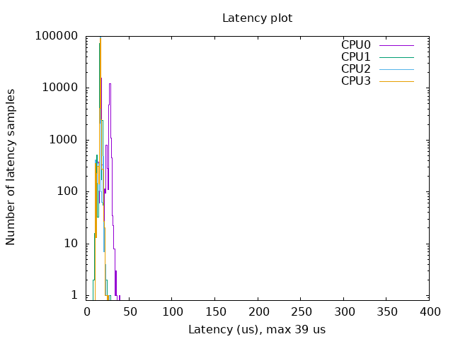
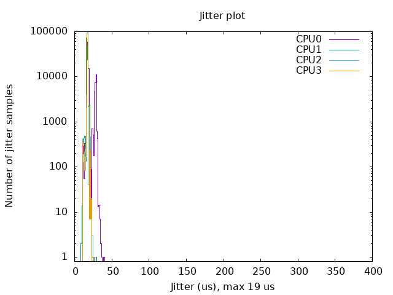

# Improved-Cyclictest
We can modify the cyclictest to achieve our own testing purposes.  
The current program can measure latency and jitter, and display the test results through histograms.  
After cloning this file locally, follow the following steps to test.

## Usage

### Install required support packages

``` bash
sudo apt-get install build-essential libnuma-dev 
sudo apt-get install gnuplot
```

### Compile

``` bash
cd Improved-Cyclictest
make all
sudo make install
```

### Running example

The purpose of this example is to test the real-time performance of the current system without other special functions.  
If you need to test the real-time performance of the corresponding program, you can modify `test_output_plot.bash` to achieve the expected results.  

``` bash
cd example
chmod +x test_output_plot.bash
sudo ./test_output_plot.bash
```

If you see `Cyclictest finished !` words and no other words indicate that the test has been successfully completed.   

You can view the test results in the current folder.  

### Analysis of test results

`output` is the output file of the test program, which contains statistical data and simple data analysis.  

`latency.png ` and `jitter.png `  are histograms drawn according to the data in `output` , as shown below.  

Other documents are intermediate documents for drawing convenience only.  





We can see that the maximum latency is 39 us and the maximum jitter is 19 us.  

Go and test the real-time performance of your system.

### Reference resources

[realtime:documentation:howto:tools:rt-tests [Wiki\] (linuxfoundation.org)](https://wiki.linuxfoundation.org/realtime/documentation/howto/tools/rt-tests)

[Create a latency plot from cyclictest histogram data: OSADL - Open Source Automation Development Lab eG](https://www.osadl.org/Create-a-latency-plot-from-cyclictest-hi.bash-script-for-latency-plot.0.html)
